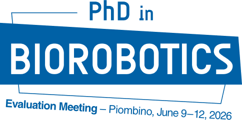
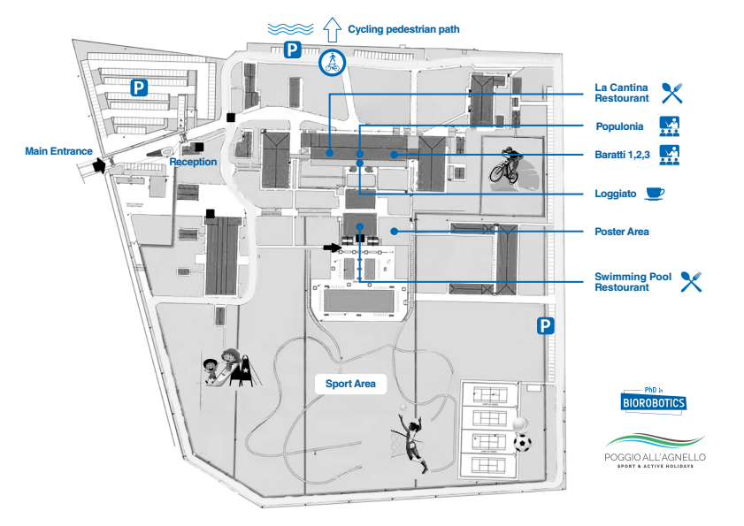

<!-- # Evaluation Meeting Program
**Piombino, June 9–12, 2026** -->

---

- [Agenda](#agenda)
  - [DAY 1 — Tuesday, June 9](#day-1--tuesday-june-9)
  - [DAY 2 — Wednesday, June 10](#day-2--wednesday-june-10)
  - [DAY 3 — Thursday, June 11](#day-3--thursday-june-11)
  - [DAY 4 — Friday, June 12](#day-4--friday-june-12)
- [Logistics](#logistics)
  - [Wi-Fi information](#wi-fi-information)
  - [Map](#map)
  - [Rooms access in plenary and parallel tracks](#rooms-access-in-plenary-and-parallel-tracks)
  - [June 12th – Departure and Logistics](#june-12th--departure-and-logistics)
- [Track Panels](#track-panels)
    - [Track 1 Panel](#track-1-panel)
    - [Track 2 Panel](#track-2-panel)

---

# Agenda

> [Download agenda]({{ '/media/agenda-program-2026.pdf' | relative_url }})

## DAY 1 &mdash; Tuesday, June 9

| Time   | Activity                                  | Location              | Participants |
|--------|-------------------------------------------|-----------------------|--------------|
| Morning | _Pick-up, Arrival & Check-in_                      | —                     | — |
| 12:00  | _Lunch_                                    | La Cantina Restaurant | — |
| 14:00  | **Welcome & Intro**                          | Baratti 1+2+3         | Prof. Ricotti & Ciuti |
| 14:30  | Block 1 (I year)                         | Baratti 1+2+3         | _Chairs: Menciassi, Crea, Mazzoni, Maselli, Filosa_ Aurora Balandi, Giulia Lomele, Luca Murra, Carlo Preziuso, Camilla Baselli, Simone Rossi, Alfonso Maria Stanzione |
| 16:30  | _Coffee break_                             | Loggiato              | — |
| 17:00  | Block 2 – Track 1 (II year)              | Baratti 1             | _Chairs: Stabile, Cianchetti, Mastinu, Cappello_ Lorenzo Amati, Niccolò Bergo, Gian Paolo Currà, Marco Anselmi, Marco Lupi, Mariagrazia Polizzotto |
| 17:00  | Block 2 – Track 2 (II year)              | Baratti 2+3           | _Chairs: Vannozzi, Meder, Oddo, Sabatini_ Leonardo Corsi, Nadia D’Alessandro, Salvatore Falciglia, Anita Casadei, Alessandro Piccolo, Rita Habib |
| 18:00  | **Invited Talk**             | Baratti 1+2+3         | **Mario Pansera** |
| 18:00  | _Faculty meeting_            | Populonia         | — |
| 19:00  | **Aperi-Poster**            | Poster Area           | Poster presenters (III year) |

---

## DAY 2 &mdash; Wednesday, June 10

| Time   | Activity                                  | Location              | Participants |
|--------|-------------------------------------------|-----------------------|--------------|
| 08:00  | _Breakfast_                                | La Cantina Restaurant | — |
| 09:30  | Block 1 (I year)                         | Baratti 1+2+3         | _Chairs: Oddo, Pucci, Redolfi Riva, Proietti_ Mahla Shahabishalghouni, Dana Abilmazhinova, Valentina Giannotti, Chiara Catania, Luca Cinus, Michele Ibrahimi, Vito Romanello |
| 11:30  | _Coffee break_                             | Loggiato              | — |
| 12:00  | Block 2 – Track 1 (II year)              | Baratti 1             | _Chairs: Laschi, Trigili, Palagi, Ciofani_ Mariateresa Pedone, Joseph Troy Baker, Silvia Fattorini, Federica Rosellini, Muhammad Awais, Andrea Campanelli |
| 12:00  | Block 2 – Track 2 (II year)              | Baratti 2+3           | _Chairs: Greco, Redolfi Riva, Carpaneto, Proietti_ Anna Labardi, Chiara Galfano, Federico Fattorini, Marco Griffa, Davide Mocellin, Giorgia Romano, Veronica Santoro |
| 13:30  | _Lunch_                                    | La Cantina Restaurant | — |
| 13:30  | _Faculty Meeting_                          | Populonia             | — |
| 15:00  | Block 3 (I year)                         | Baratti 1+2+3         | _Chairs: Iacovacci, Ciuti, Controzzi, Cafarelli_ Sascha Müller, Federico Andrei, Alessandro Foglia, Alberto Sarti, Chanuka Lihini Tennakoon Tennakoon Mudiyanselage, Sreeja Saraswati |
| 16:30  | _Coffee break_                             | Loggiato              | — |
| 17:00  | Block 4 (I year)                         | Baratti 1+2+3         | _Chairs: Cipriani, Russo, Romano, Carpaneto_ Xiao Bai, Xinyang Huang, Jiaqi Li, Luciana Ercolanese, Yuriy Derevyanchuk, Carmen Panepinto Zayati |
| 18:30  | **Invited Talk**        | Baratti 1+2+3         | **Francesco Bettella** |
| 18:30  | _Faculty Meeting_                          | Populonia             | — |
| 19:30 | **_Group Picture_**                  | —                     | — |
| 20:30 | _Dinner_                  | Swimming Pool Restaurant                    | — |
| &nbsp; | _After Dinner_                  | Bagno Baratti                    | — |

---

## DAY 3 &mdash; Thursday, June 11

| Time   | Activity                                  | Location              | Participants |
|--------|-------------------------------------------|-----------------------|--------------|
| 08:00  | _Breakfast_                                | La Cantina Restaurant | — |
| 09:30  | Block 1 (I year)                         | Baratti 1+2+3         | _Chairs: Trigili, Meder, Vannozzi, Ferrari_ Yuhe Chen, Greta Feregotto, Chiara Muscarella, Jackeline Soto Cruz, Laura Russo, Mariana Tavares Pimenta, Adriana Saavedra |
| 11:30  | _Coffee break_                             | Loggiato              | — |
| 12:00  | Block 2 – Track 1 (II year)              | Baratti 1             | _Chair: Cipriani, Calisti, Laschi, Maselli_ Giulia Gigante, Samuel Mosenhanna Youssef, Fabrizio Moncelli, Christina Chase-Markopoulou, Camilla Schirru, Amirreza Mansoorikermani |
| 12:00  | Block 2 – Track 2 (II year)              | Baratti 2+3           | _Chair: Cafarelli, Micera, Pucci, Falotico_ Hector Ramirez Lara, Francesco Pierotti, Filippo Castellani, Iro Papagiannaki, Daliayvette Domínguez Jiménez, Francesca Parrotta |
| 13:00  | **Prospective Speech**         | Baratti 1+2+3         | **Prof. Paolo Dario** |
| 13:30  | _Lunch_                                    | La Cantina Restaurant | — |
| 13:30  | _Faculty Meeting_                         | Populonia             | — |
| 15:00  | Block 3 (I year)                         | Baratti 1+2+3         | _Chairs: Palagi, Gherardini, Cianchetti, Ciofani, Calisti_ Nicole Giannotto, Marianna Santucci, Tommaso Lambresa, Francesco Varnier, Niccolò Picchiarelli |
| 16:30  | _Coffee break_                             | Loggiato              | — |
| 17:00  | Block 4 (I year)                         | Baratti 1+2+3         | _Chairs: Cappello, Meneghetti, Mattoli, Mastinu_ Marlena Caruso, Martino Singuaroli, Valentina Arditi, Matilde Santini, Laura Patrícia Guerra Manso, Chang Liu |
| 18:30  | _Social Activities_                        | Sport Area            | — |
| 18:30  | _Faculty Meeting_                          | Populonia             | — |
| 20:30  | _Dinner_                                  | La Cantina Restaurant | — |

---

## DAY 4 &mdash; Friday, June 12

| Time   | Activity                                  | Location              | Participants |
|--------|-------------------------------------------|-----------------------|--------------|
| 08:00  | _Breakfast_                                | La Cantina Restaurant | — |
| 09:30  | **Award Ceremony**                          | Baratti 1+2+3         | _Chairs: Mazzoni, Ricotti_ |
| 10:30  | _Check-out_                    | —                     | — |
| 11:30  | _Transfers_                    | —                     | — |
| 13:30  | _Faculty Lunch_                            | Ristorante            | — |
| 18:00  | _Transfers_                    | —                     | — |

---

# Logistics

## Wi-Fi information

> Network:&nbsp; `Conference`  
> Password: `Sala2022`

## Map

> [Download map]({{ '/media/map-2026.pdf' | relative_url }})

## Rooms access in plenary and parallel tracks

When using the full Meeting Room **Baratti 1+2+3**, access to the room is available from the **_Foyer_** (the registration/accreditation area in front of the meeting rooms).
When the two rooms are divided and the partition door is completely closed (meaning **Baratti 1** is separated from **Baratti 2+3**), access to **Baratti 1** must be through the columned **_Portico_** (facing the bar).

## June 12th – Departure and Logistics

**Check-out Schedule:** All participants are kindly requested to check out by **11:00 AM** (strict deadline). 
An exception is granted to the Professors remaining for lunch, who may retain their apartments until 3:00 PM.

**Key Return:** Participants must return their keys to Reception by **11:00 AM**.

**Luggage Storage:** For guests wishing to store their luggage prior to departure, a designated Luggage Store will be available in the Meeting Rooms Foyer on the morning of June 12th.

**Bus Parking:** The two buses will be parked in a restricted area near the Piaggione (the same courtyard utilized for check-in). 
Participants will find the buses stationed adjacent to the Piaggione after checking out.

---

# Track Panels

### Track 1 Panel
Matteo Cianchetti, Marco Controzzi, Enzo Mastinu, Nicola Vitiello, Leonardo Cappello, Simona Crea, Christian Cipriani, Marta Gherardini, Gianni Ciofani, Gastone Ciuti, Martina Maselli, Stefano Palagi, Linda Paternò, Paolo Dario, Emilio Trigili, Veronica Iacovacci, Cecilia Laschi, Marcello Calisti, Lucia Beccai, Giovanni Stabile, Virgilio Mattoli

### Track 2 Panel
Antonio De Simone, Andrea Cafarelli, Eugenio Redolfi Riva, Fabian Gerd Meder, Calogero Maria Oddo, Jacopo Carpaneto, Leonardo Ricotti, Francesco Greco, Alberto Mazzoni, Lorenzo Vannozzi, Angelo Maria Sabatini, Silvestro Micera,  Debora Angeloni, Mariangela Filosa, Eleonora Russo, Egidio Falotico, Paolo Dario, Laura Ferrari, Andrea Bandini, Tommaso Proietti, Carlotta Pucci, Nicolo Meneghetti, Arianna Menciassi, Donato Romano